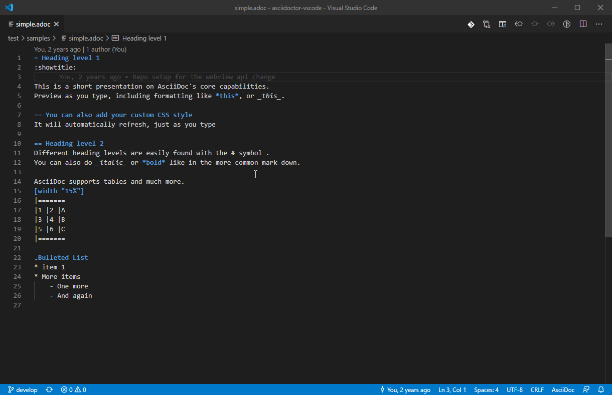

# AsciiDoc support for Visual Studio Code

[](https://marketplace.visualstudio.com/items?itemName=joaompinto.asciidoctor-vscode)
[](https://marketplace.visualstudio.com/items?itemName=joaompinto.asciidoctor-vscode)
[](https://vsmarketplacebadge.apphb.com/rating/joaompinto.asciidoctor-vscode.svg)

An extension that provides live preview, syntax highlighting and symbols for the AsciiDoc format. The preview uses [Asciidoctor.js](https://asciidoctor.org/docs/asciidoctor.js/).

Use the extension, by opening an .adoc file and then:

* Toggle Preview - `ctrl+shift+v` (Mac: `cmd+shift+v`)
* Open Preview to the Side - `ctrl+k v` (Mac: `cmd+k v`)
* View symbols - go to symbol action - `ctrl+shift+o`, select a heading.

## How to install

Launch VS Code Quick Open (Ctrl+P), paste the following command, and press enter:

    ext install joaompinto.asciidoctor-vscode

## Demo



## Optional

If you want to use the Ruby version of [**Asciidoctor**](http://asciidoctor.org/docs/install-toolchain/ ) you need to change the AsciiDoc.use_asciidoctor_js setting to _false_.

## How to build and install from source (Linux)

### Manual build

```bash
git clone https://github.com/asciidoctor/asciidoctor-vscode
cd asciidoctor-vscode
npm install
sudo npm install -g vsce typescript
vsce package
code --install-extension *.vsix
```

### Build script

```bash
git clone https://github.com/asciidoctor/asciidoctor-vscode
bash ./script/build.sh build install
```

The build script accepts other commands too, run `bash ./script/build.sh help` for more information.

## Contributors

```git log --pretty="%an" | sort -u```

    Bart Sokol
    Daniel Mulholland
    Garrett D'Amore
    Gigacee
    Jackson C. Wiebe
    João Pinto
    Kevin Palmowski
    Marcelo Alvim
    Mark Roszko
    Masanori Asano
    Matteo Campinoti
    Stephen Pegoraro
    Tatsunori Uchino
    chriskoerner
    ojn
    sgn
    Øyvind Hansen
