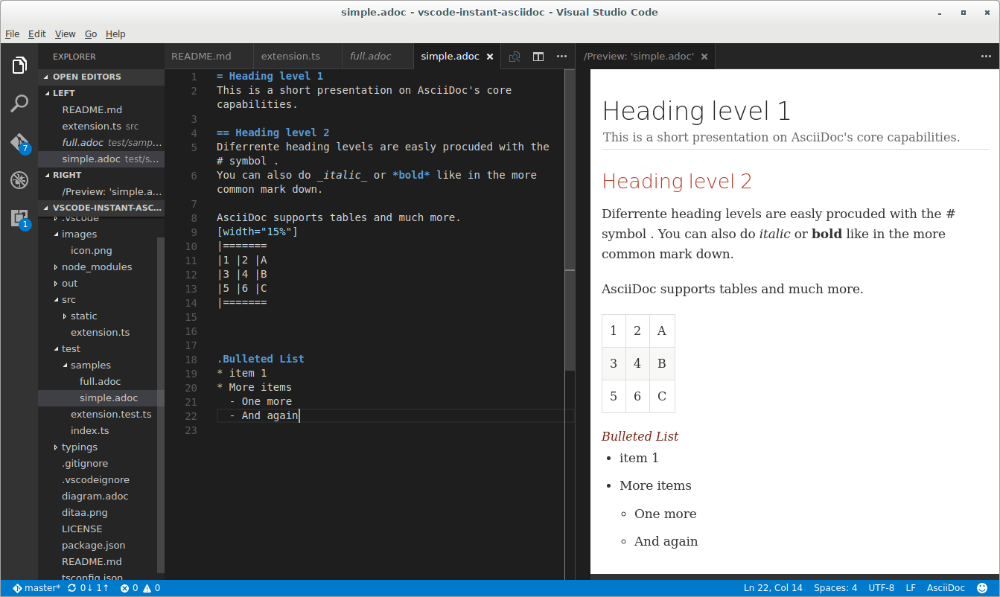

# AsciiDoc Previewer

An extension to preview AsciiDoc text using the _AsciiDoctor_ publishing tool.

The extension can be activate in two ways

* Toggle Preview - `ctrl+shift+r`
* Open Preview to the Side - `ctrl+k r`




## Prerequisites

You need to [**install AsciiDoctor**](http://asciidoctor.org/docs/install-toolchain/ ) - A fast text processor & publishing toolchain for converting AsciiDoc to HTML5, DocBook & more.

## How to build and install from source (Linux)
```
git clone https://github.com/joaompinto/asciidoctor-vscode
cd vscode-instant-asciidoc
npm install
sudo npm install vsce
vsce package
code --install-extension *.vsix
```

## Credits:
This extension code was based on https://github.com/tht13/RST-vscode/