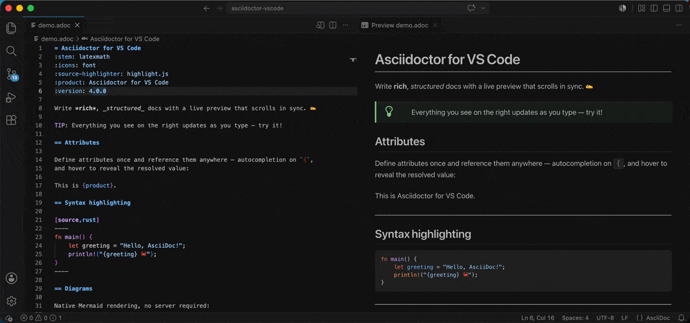

# AsciiDoc support for Visual Studio Code

[](https://marketplace.visualstudio.com/items?itemName=asciidoctor.asciidoctor-vscode)
[](https://marketplace.visualstudio.com/items?itemName=asciidoctor.asciidoctor-vscode)
[](https://marketplace.visualstudio.com/items?itemName=asciidoctor.asciidoctor-vscode)
[](https://chat.asciidoctor.org/)

An extension that provides live preview, syntax highlighting, and snippets for the AsciiDoc format using Asciidoctor.



## Install

Launch Visual Studio Code "Quick Open" (`Ctrl+P`), paste the following command, and press `Enter`:

```
ext install asciidoctor.asciidoctor-vscode
```

Alternatively, use the built-in extension browser to find the _AsciiDoc_ extension by _asciidoctor_ and install it.

## Documentation

The full documentation lives at [docs.asciidoctor.org/vscode-extension](https://docs.asciidoctor.org/vscode-extension/).

## Issues

Found a bug or have a question? Please check the [existing issues](https://github.com/asciidoctor/asciidoctor-vscode/issues) first, then open a new one. See [Get help](https://docs.asciidoctor.org/vscode-extension/get-help/) for what to include.

## Contributing

Contributions are welcome. See [Contributing](https://docs.asciidoctor.org/vscode-extension/contributing/) to get started.
