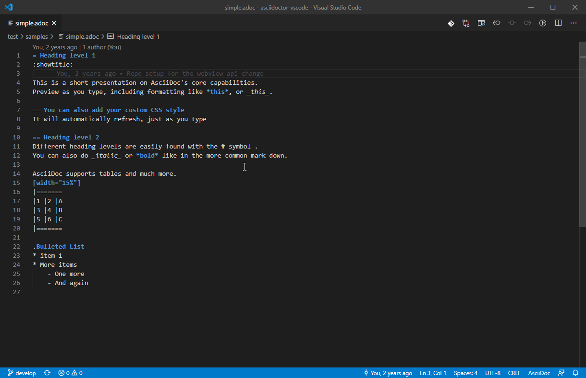

# AsciiDoc support for Visual Studio Code

[](https://marketplace.visualstudio.com/items?itemName=asciidoctor.asciidoctor-vscode)
[](https://marketplace.visualstudio.com/items?itemName=asciidoctor.asciidoctor-vscode)
[](https://marketplace.visualstudio.com/items?itemName=asciidoctor.asciidoctor-vscode)
[](https://chat.asciidoctor.org/)

An extension that provides live preview, syntax highlighting, and snippets for the AsciiDoc format using Asciidoctor.



## Install

Launch Visual Studio Code "Quick Open" (`Ctrl+P`), paste the following command, and press `Enter`:

```
ext install asciidoctor.asciidoctor-vscode
```

Alternatively, use the built-in extension browser to find the _AsciiDoc_ extension by _asciidoctor_ and install it.

## Documentation

The full documentation lives in [`docs/`](docs/modules/ROOT/pages/index.adoc):

- [Quick start](docs/modules/ROOT/pages/quick-start.adoc)
- [Install and update](docs/modules/ROOT/pages/install.adoc)
- Features
  - [Edit AsciiDoc files](docs/modules/ROOT/pages/edit.adoc)
  - [Preview](docs/modules/ROOT/pages/preview.adoc)
  - [Export as PDF](docs/modules/ROOT/pages/export-pdf.adoc)
  - [Save as HTML](docs/modules/ROOT/pages/save-html.adoc)
  - [Save as DocBook](docs/modules/ROOT/pages/save-docbook.adoc)
  - [Paste an image](docs/modules/ROOT/pages/paste-image.adoc)
  - [Snippets](docs/modules/ROOT/pages/snippets.adoc)
  - [Diagram integration](docs/modules/ROOT/pages/diagram.adoc)
  - [Asciidoctor.js extensions](docs/modules/ROOT/pages/asciidoctorjs-extensions.adoc)
  - [Asciidoctor configuration file](docs/modules/ROOT/pages/asciidoctorconfig.adoc)
  - [Identify the VS Code environment](docs/modules/ROOT/pages/vscode-environment.adoc)
- [Settings](docs/modules/ROOT/pages/settings.adoc)
- [Build from source](docs/modules/ROOT/pages/build-from-source.adoc)
- [Contributing](docs/modules/ROOT/pages/contributing.adoc)
- [Get help](docs/modules/ROOT/pages/get-help.adoc)

## Issues

Found a bug or have a question? Please check the [existing issues](https://github.com/asciidoctor/asciidoctor-vscode/issues) first, then open a new one. See [Get help](docs/modules/ROOT/pages/get-help.adoc) for what to include.

## Contributing

Contributions are welcome. See [Contributing](docs/modules/ROOT/pages/contributing.adoc) to get started.
